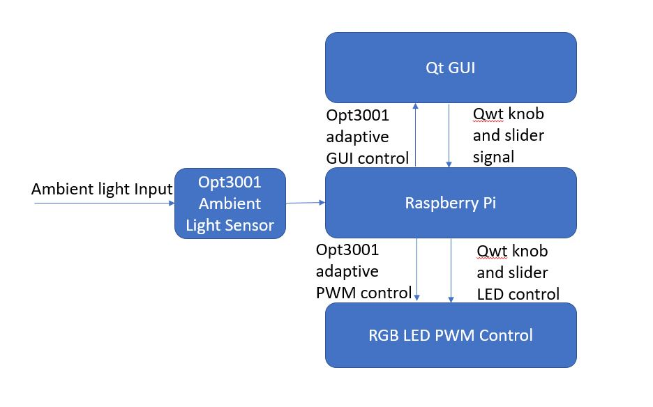

[]()           [](https://twitter.com/RgbSmart)            [](https://www.youtube.com/channel/UCd6fxMEmMy2eHsSU_8GLoLQ?view_as=subscriber)             [](https://www.instagram.com/smart_rgb_light/)

# SMART LIGHT
_A QT GUI based adaptive light application._
## Team Members
 _Xiao Wang_
 
 _Ruigang Chen_
## Introdction
The purpose of the project is to design a smart light that could be interesting to play with(RGB LED on GUI) and adaptive to the environment - when environment is bright, smart light is supposed to be dark so that saving power. When environment is dark, smart light is designed to be bright so that offering light source. This project is corresponding to the Realtime Embeded Programming course in [University of Glasgow](https://www.gla.ac.uk).

Any idea, improvement or problem you want to share with us could click the social media image above to interact with us. All relavent software code and hardware files are shared in repository of this github. More details about the project is introduced in wiki, please feel free to have a look. 

## Final Operation
The video of the final operation please click [link](https://www.youtube.com/channel/UCd6fxMEmMy2eHsSU_8GLoLQ?view_as=subscriber), image below or youtube channel.

when environment is bright, smart light is supposed to be dark so that saving power. When environment is dark, smart light is designed to be bright so that offering light source.

[](https://www.youtube.com/channel/UCd6fxMEmMy2eHsSU_8GLoLQ?view_as=subscriber) 

## QT GUI 
The window to control the RGB is shown below. Tow mode of operation could be chosen with silder at left and right. First mode at left is to disable the ambient sensor only working with knob to control RGB. Second mode at right is to enable the ambient sensor which set treshold limiting the maximum intensity the LED could go. The treshold is adaptive to the environment light intensity and RGB could be controlled at the same time below the treshold. 


## Software Block Diagram
Software have two thread as indicated below. One thread is qwt knob and slider control, another thread is opt3001 adaptive threshold of limiting the maximum PWM. It means that while knobs are being adjusted, the maximum light intensity could change at the same time- according to the environment light intensity. 


## How to Try With Our Code
- Setup enviroment
Install the QT5 and Qwt development packages:

```

  apt-get install qtdeclarative5-dev-tools
  apt-get install libqwt-qt5-dev
  
```
To clone the git repository:

```

git clone https://github.com/smart-light/team13-UofG/software/Main

```
  qmake
  
  make
  
  sudo ./Main
  
  
- BOM is offered and PCB is designed as files in hardware zip(addr pin of opt3001 goes to 5v on RPi to setup LSB) 

  Have fun!(PCB is designed as purpose of powering RPi but it draws large current so that in PCB design please ignore the pin for powering RPi and use that ground pin for sinals reference connected to groud of RPi)

## Future Work
- Power rate of the LED could be designed greater so the outcome of the design could be fancy
- Overview of the LED need to be improved for looking better
- More sensors could be applied for variable application. This could be a platform to be built on.
