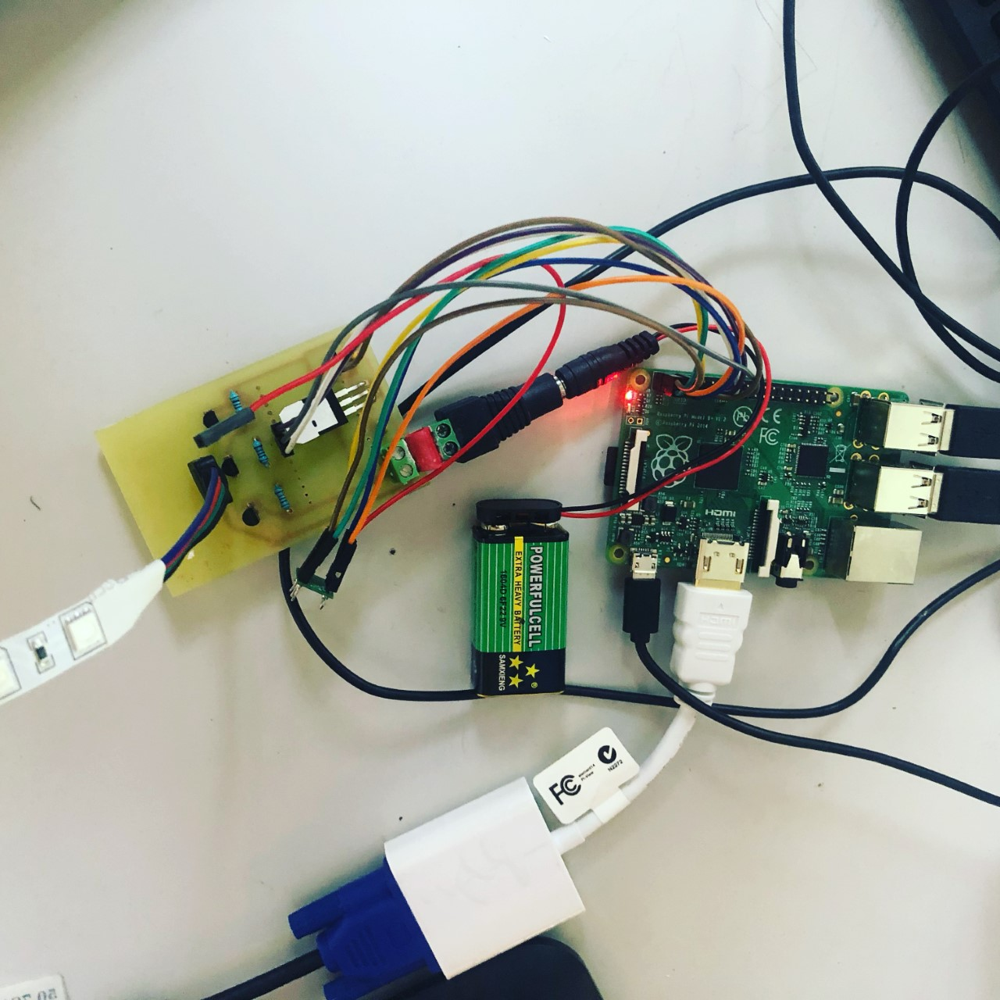

                                    

# SMART LIGHT
_A QT GUI based adaptive light application._
## Team Members
 _Xiao Wang_
 
 _Ruigang Chen_
## Introdction
The purpose of the project is to design a smart light that could be interesting to play with(RGB LED on GUI) and adaptive to the environment - when environment is bright, smart light is supposed to be dark so that saving power. When environment is dark, smart light is designed to be bright so that offering light source. This project is corresponding to the Realtime Embeded Programming course in [University of Glasgow](https://www.gla.ac.uk).

Any idea, improvement or problem you want to share with us could click the social media image above to interact with us. All relavent software code and hardware files are shared in repository of this github. More details about the project is introduced in wiki, please feel free to have a look. 

## Final Operation
The video of the final operation please click image link below or youtube channel.

when environment is bright, smart light is supposed to be dark so that saving power. When environment is dark, smart light is designed to be bright so that offering light source.

 

## QT GUI 
The window to control the RGB is shown below. Tow mode of operation could be chosen with silder at left and right. First mode at left is to disable the ambient sensor only working with knob to control RGB. Second mode at right is to enable the ambient sensor which set treshold limiting the maximum intensity the LED could go. The treshold is adaptive to the environment light intensity and RGB could be controlled at the same time below the treshold. 

## Block Diagram

